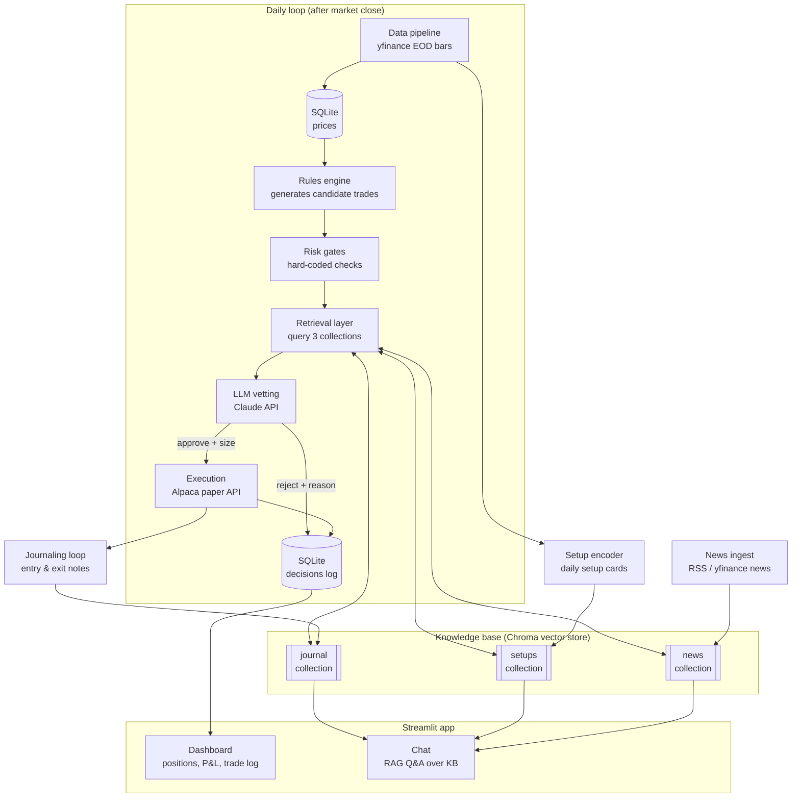

# Cognitive Trader — System Architecture

A retrieval-augmented swing-trading assistant. Quantitative rules propose trades on US stocks (daily bars, holds of days to weeks); an LLM vets each candidate by retrieving evidence from a knowledge base — your own trade journal, similar historic setups, and market news — and returns an approve/reject/size decision with cited reasoning. Trades execute on an Alpaca paper account. A Streamlit app provides a dashboard and a chat interface over the knowledge base.

**Framing:** this is decision support with retrieval-grounded reasoning, not a "profitable bot." The differentiator is that every decision is explainable: you can always see *what evidence was retrieved* and *why the AI decided what it did*.

---

## 1. System overview



## 2. The daily loop, narrated

Every weekday around 5pm ET (after close), one script — `run_daily.py` — does the following:

1. **Ingest.** Pull the day's OHLCV bars for the ticker universe via yfinance into SQLite. Pull recent headlines into the news collection.
2. **Encode the day.** For each ticker, write a "setup card" (Section 5.2) describing today's technical state, and embed it into the `setups` collection.
3. **Signal.** The rules engine scans every ticker and emits zero or more *candidate trades* — structured objects saying "rule X fired on ticker Y, here's the context."
4. **Gate.** Hard-coded risk checks run *before* any AI involvement: position-size caps, max open positions, sector concentration, duplicate-position checks. Candidates that fail are logged and dropped. (Risk limits are never delegated to the LLM — see Section 6.)
5. **Retrieve.** For each surviving candidate, the retrieval layer queries the three Chroma collections: past journal entries about similar trades, historically similar setup cards (with their forward outcomes), and recent news mentioning the ticker.
6. **Vet.** The retrieved evidence + candidate go to Claude with a strict JSON output contract (Section 7). The model returns `approve`/`reject`, a position size within the gate's cap, its confidence, written reasoning, and citations pointing at specific retrieved items.
7. **Execute.** Approved trades become bracket orders (entry + stop-loss + take-profit) on the Alpaca paper account, queued for next morning's open.
8. **Journal.** Every decision — approved or rejected — is logged. When a position eventually closes, an *exit journal entry* records the outcome and a short post-mortem, and is embedded back into the `journal` collection. This is the feedback loop: future retrievals see past outcomes.

Because everything happens after close, there is no latency pressure — the LLM can take as long as it needs, and a day's run costs pennies.

## 3. Tech stack

| Layer | Choice | Cost | Why |
|---|---|---|---|
| Language | Python 3.11+ | free | One language everywhere; best beginner ecosystem |
| Market data | yfinance (EOD daily bars) | free | Reliable enough for daily bars; no API key needed |
| Broker | Alpaca paper trading API | free | Real REST API, real order types; going live later is a config change |
| Relational DB | SQLite | free | Zero-setup, single file, perfect at this scale |
| Vector store | Chroma (local, persistent) | free | Embedded mode, no server to run |
| Embeddings | sentence-transformers `all-MiniLM-L6-v2`, local | free | Good quality for short text; keeps embedding cost at $0 |
| Generation LLM | Claude API — Haiku for backtests, Sonnet for daily vetting | ~$5–15/mo during dev | The only paid piece; see design decisions |
| News | yfinance ticker news + RSS feeds | free | Adequate for headlines/summaries at daily cadence |
| UI | Streamlit | free | Dashboard + chat in pure Python; free Community Cloud hosting |
| Hosting (demo) | Streamlit Community Cloud | free | Public URL for recruiters |

## 4. Data model (SQLite)

Six tables. `TEXT` ISO-8601 for dates, `REAL` for prices.

```sql
-- Daily bars per ticker
CREATE TABLE prices (
    ticker TEXT, date TEXT, open REAL, high REAL, low REAL,
    close REAL, volume INTEGER,
    PRIMARY KEY (ticker, date)
);

-- Every rule firing, whether or not it survived gates/vetting
CREATE TABLE signals (
    id INTEGER PRIMARY KEY,
    date TEXT, ticker TEXT, rule_name TEXT,
    direction TEXT,              -- 'long' (v1 is long-only)
    context_json TEXT            -- indicator values at signal time
);

-- Every LLM vetting decision, tied to a signal
CREATE TABLE decisions (
    id INTEGER PRIMARY KEY,
    signal_id INTEGER REFERENCES signals(id),
    date TEXT, verdict TEXT,     -- 'approve' | 'reject'
    size_pct REAL,               -- of portfolio, <= gate cap
    confidence REAL,             -- 0-1
    reasoning TEXT,              -- the written rationale
    citations_json TEXT,         -- ids of retrieved items relied on
    model TEXT, prompt_version TEXT
);

-- Actual orders/fills on Alpaca
CREATE TABLE trades (
    id INTEGER PRIMARY KEY,
    decision_id INTEGER REFERENCES decisions(id),
    ticker TEXT, direction TEXT,
    entry_date TEXT, entry_price REAL, qty REAL,
    stop_price REAL, target_price REAL,
    exit_date TEXT, exit_price REAL,
    exit_reason TEXT,            -- 'stop' | 'target' | 'time' | 'manual'
    pnl REAL, pnl_pct REAL,
    status TEXT                  -- 'open' | 'closed'
);

-- Human/AI-written narrative entries; mirrored into Chroma
CREATE TABLE journal_entries (
    id INTEGER PRIMARY KEY,
    trade_id INTEGER REFERENCES trades(id),
    date TEXT, kind TEXT,        -- 'entry' | 'exit' | 'note'
    text TEXT,
    embedded INTEGER DEFAULT 0   -- synced to Chroma yet?
);

-- Headlines/summaries; mirrored into Chroma
CREATE TABLE news_items (
    id INTEGER PRIMARY KEY,
    date TEXT, ticker TEXT, source TEXT, url TEXT,
    headline TEXT, summary TEXT,
    embedded INTEGER DEFAULT 0
);
```

SQLite is the source of truth; Chroma is a derived index. If the vector store is ever corrupted or the embedding model changes, rebuild it entirely from SQLite (`scripts/rebuild_index.py`). This one decision removes a whole class of sync bugs.

## 5. Retrieval design (the RAG core)

Three Chroma collections, all embedded with the same local model.

### 5.1 `journal` — learning from your own trades

Each closed trade produces an exit entry like:

> *2026-07-20 — Closed AAPL long after 9 days, +3.1%. Entered on MA-pullback rule during uptrend; earnings were 15 days out at entry. Exited at target. Lesson: pullback entries in strong trends with no imminent earnings have been working.*

Metadata: `ticker`, `rule_name`, `outcome` (win/loss), `pnl_pct`, `hold_days`, `date`. Retrieval query for a new candidate: embed a description of the candidate ("MA-pullback long on MSFT, uptrend, earnings in 12 days") and fetch top-k similar entries, optionally filtered to the same rule. The AI literally reads "the last four times you took this kind of trade, here's what happened."

### 5.2 `setups` — similar historic price patterns

Numeric price windows don't embed well as raw numbers, so each (ticker, day) is rendered as a **setup card** — a templated text snapshot:

> *MSFT 2026-07-06. Trend: above rising 50d MA (+4.2%), 200d MA rising. Momentum: RSI-14 at 41, pulled back 3 days from 20d high. Volatility: ATR 1.8% of price, near 6-mo median. Volume: 0.9x 20d average. Extension: 2.1% above 50d MA. Earnings: in 12 days.*

Because cards are templated, similar market states produce similar text and embed near each other. Each card's metadata stores **forward returns** (`fwd_5d`, `fwd_10d`, `fwd_20d`), backfilled as data arrives. Retrieving the 10 nearest historical cards gives the AI an empirical base rate: "in the 10 most similar past setups, median 10-day forward return was +1.9%, 7 of 10 positive."

Backfill ~3 years × ~30 tickers ≈ 22,000 cards — a few minutes of local embedding, one-time.

(An alternative is k-NN over raw numeric feature vectors — arguably purer, and a good interview discussion point. Text cards win for v1 because one retrieval mechanism serves all collections, and cards are human-readable in the UI: you can *show* the evidence.)

### 5.3 `news` — recent context (Phase 3)

Headlines + summaries per ticker, metadata `ticker`/`date`/`source`. Retrieval is filtered to the candidate's ticker and the last ~10 days, ranked by relevance to the setup description. Deferred to week 5; the system is fully functional without it.

### 5.4 Query construction

One function, `build_retrieval_bundle(candidate)`, produces the vetting context:

- journal: top 4 similar entries (same-rule filter preferred, backfill without it)
- setups: top 10 similar historic cards + computed forward-return stats
- news: top 5 recent items for the ticker (once Phase 3 lands)

Every retrieved item carries an id; those ids are what the LLM must cite. The full bundle is stored with the decision, so the dashboard can render exactly what the model saw.

## 6. Rules engine and risk gates

### Rules (v1: three, long-only)

1. **Trend-pullback** — close above rising 50d MA, and RSI-14 dipped below 40 then turned up. Classic "buy the dip in an uptrend."
2. **Breakout** — close above the prior 20-day high on volume ≥ 1.5× its 20-day average.
3. **Oversold mean-reversion** — RSI-14 below 30 while still above the 200d MA (long-term uptrend intact).

Each rule is a pure function `(price_history) -> Optional[Candidate]` — trivially unit-testable, easy to add more later. Deliberately simple: the rules are candidate *generators*, wide-net by design; the interesting judgment lives in the vetting layer.

### Risk gates (hard-coded, pre-LLM, non-negotiable)

- Max position size: 10% of portfolio equity
- Max open positions: 5
- Max 1 open position per ticker; max 2 per sector
- Every trade carries a stop-loss at entry (ATR-based, ~2× ATR below entry)
- Risk per trade (entry-to-stop distance × size) ≤ 2% of portfolio
- Time stop: positions auto-close after 20 trading days

The LLM can size a trade *below* the cap or reject it — it can never exceed the gates. Safety properties are enforced in code, not delegated to a model. Positions also close automatically on stop/target/time via the bracket order, so no LLM call is ever needed to exit.

## 7. The vetting contract

Input: candidate + retrieval bundle. Output must parse as:

```json
{
  "verdict": "approve",
  "size_pct": 6.5,
  "confidence": 0.62,
  "reasoning": "The trend-pullback setup on MSFT resembles setups [S-1842, S-0977], where 10-day forward returns were positive in 7 of 10 nearest matches (median +1.9%). Your journal shows 3 wins in 4 similar trades [J-31, J-27, J-19]; the loss [J-22] came when earnings were <5 days out — here earnings are 12 days out. No adverse news retrieved. Sizing below cap due to elevated market-wide volatility noted in [S-1901].",
  "citations": ["S-1842", "S-0977", "J-31", "J-27", "J-19", "J-22"],
  "risk_notes": "Earnings in 12 days; consider exiting before if still open."
}
```

Contract rules enforced in code: response must be valid JSON matching this schema (retry once on failure, then auto-reject with `verdict: "error"`); every citation id must exist in the bundle (hallucinated citations → auto-reject); `size_pct` is clamped to the gate cap. Prompts live in versioned files (`prompts/vet_v1.md`) and every decision records its `prompt_version` — so you can measure whether prompt changes actually improved decisions.

## 8. Backtester

Replays historical days through the identical pipeline: rules → gates → retrieval (against only data that existed *at that date* — Chroma date-filtering prevents lookahead) → vetting → simulated fills at next open, with stops/targets honored bar-by-bar.

Two modes: **rules-only** (free, fast — establishes the baseline) and **rules+LLM** on Haiku (the headline experiment: *does retrieval-grounded vetting beat the raw rules?*). LLM responses are cached by `(candidate_hash, prompt_version)` so reruns are free. Report: equity curve, win rate, max drawdown, avg win/loss — side by side for both modes. Honest reporting of this comparison, whichever way it goes, is the portfolio's credibility anchor.

## 9. Streamlit app

Three pages:

- **Dashboard** — equity curve, open positions with unrealized P&L, recent decisions feed. Each decision expands to show the full retrieval bundle and reasoning: *the money shot for demos.*
- **Trade log** — filterable table of all trades joined to decisions and journal entries; per-rule performance stats.
- **Chat** — free-form RAG Q&A over all three collections ("What's my win rate on breakout trades?", "Show me past setups like NVDA today"). Same retrieval layer, conversational prompt instead of the vetting contract.

## 10. Repository structure

```
cognitive-trader/
├── README.md               # the portfolio front door
├── ARCHITECTURE.md         # this file
├── BUILD_PLAN.md
├── config.yaml             # universe, risk caps, model names, paths
├── prompts/
│   ├── vet_v1.md
│   └── chat_v1.md
├── src/
│   ├── data/               # ingest.py, universe.py
│   ├── signals/            # rules.py, indicators.py
│   ├── risk/               # gates.py
│   ├── rag/                # setup_cards.py, embedder.py, retriever.py, chat.py
│   ├── llm/                # vetter.py, contracts.py, cache.py
│   ├── broker/             # alpaca_client.py, simulator.py
│   ├── journal/            # journaler.py
│   └── app/                # streamlit_app.py + pages/
├── scripts/
│   ├── run_daily.py        # the daily loop entrypoint
│   ├── backfill.py         # historical prices + setup cards
│   ├── backtest.py
│   └── rebuild_index.py    # regenerate Chroma from SQLite
└── tests/                  # rules, gates, contracts, retrieval
```

## 11. Key design decisions (interview talking points)

1. **Rules propose, AI disposes.** Deterministic signal generation + LLM judgment layer = testable, explainable, and an honest measurement: LLM value-add is isolated as a single ablatable stage.
2. **Risk lives in code, not prompts.** The LLM cannot exceed position caps or skip stops. Demonstrates you understand where *not* to use an LLM.
3. **Text setup cards for pattern similarity.** Templated natural-language snapshots make heterogeneous market state embeddable, human-readable, and citable. Know the numeric k-NN alternative and its tradeoffs.
4. **SQLite as truth, Chroma as derived index.** Rebuildable at any time; eliminates sync-drift bugs.
5. **Citations validated in code.** Hallucinated evidence is caught mechanically, not trusted. Prompt versioning makes decision quality measurable over time.
6. **The journal is a flywheel.** Every closed trade improves future retrievals — the system's judgment compounds with use, which is the most novel RAG angle here.
7. **No lookahead in backtests.** Date-filtered retrieval; a subtle bug most naive projects have, and a strong signal you understand evaluation hygiene.

## 12. Risks and mitigations

| Risk | Mitigation |
|---|---|
| yfinance breaks or rate-limits | Thin `DataSource` interface; Alpaca's free data API as drop-in fallback |
| LLM output drift breaks parsing | Strict schema validation, one retry, auto-reject on failure — the loop never crashes |
| Backtest looks great, live doesn't | Report both modes honestly; paper-trade for weeks before any live consideration |
| Scope creep kills the sprint | BUILD_PLAN.md cut lines; literature collection explicitly out of v1 |
| Embedding model too weak for financial nuance | Fine at this scale; swappable via `rebuild_index.py` if not |

---

*This system informs decisions; it does not guarantee profits. Most short-horizon retail traders lose money. Paper trade until the evidence says otherwise.*
